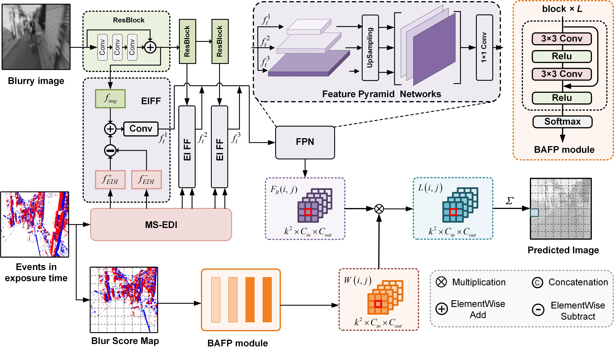

# This is the official Pytorch implementation of the paper： Event-based Motion Deblurring with Blur-aware Reconstruction Filter

## Dataset

## Train
	python training.py

 ## Test
	python testing.py
